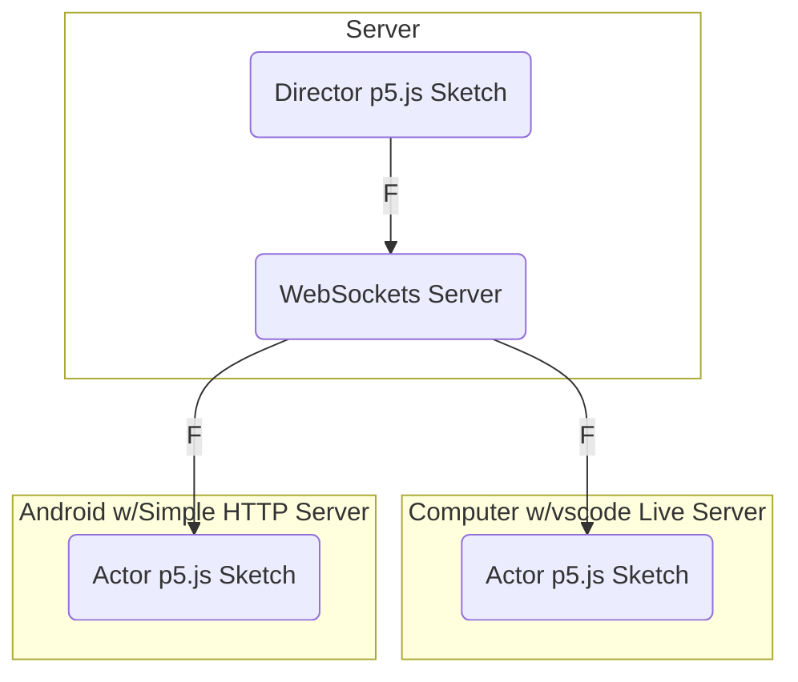

# WebSockets Communication Demo

This is a demo showing how websockets can allow communication 
across p5.js sketches on multiple different devices.

When the sketch is loaded, a connection is made to a websockets server 
by entering the server's ip:port into the text field and pressing the Connect button.

From then on, any key pressed while in the sketch is sent to the WebSockets server. 
The server is expected to echo the message back to all of its connected clients.

## How is This Useful?

A more elaborate example of how this can be useful could involve 
having a "director" sketch that controls 
many "actor" sketches at once, each on a different device.

In this example, the "director" sketch has interface/GUI that sends messages to the 
WebSockets server based on user interaction with the on-screen controls. (Or the "director" could send its messages autonomously based on a list of [cues](https://en.wikipedia.org/wiki/Cue_(theatrical)))

The WebSockets server, in turn, broadcasts the received message to any connected clients. 
The "director" receives the echoed-back messages, but ignores them. 
The "actor" sketch, on the other hand, is designed to do something in response to the messages 
(ex: play a sound, show an image, etc.)

## Caveat

While this sounds great, there is a catch. Web browsers generally do not allow insecure WebSockets
connections from secure web pages.

If you load the sketch from a web server on your local computer (eg: from vscode's Live Server extension), 
it will work. If you load the sketch from a GitHub Pages site (which uses `https`), it won't work.

Some browsers have secret settings that will ignore this security issue. In Firefox, it's done by 
going to the `about:config` URL and setting `network.websocket.allowInsecureFromHTTPS` to `true`. 
(You'd want to set it back to `false` when it's not needed!). Unfortunately, on phone browsers you don't
have an equivalent option.

It's possible to avoid changing that setting and to also make it work with a phone, however. 
For example, in the director/actor example described above, the "director" sketch could be 
served locally using vscode's Live Server, for example. Since that local web server is served with `http` instead of `https`,
the browser will have no issue allowing insecure WebSockets connections. On an Android phone, 
you could have the same setup of serving the "actor" web page locally. [Simple HTTP Server](https://play.google.com/store/apps/details?id=com.phlox.simpleserver&hl=en_US) is an example of an Android
app that can do the job. The local URL would then be loaded in the phone browser of your choice.

> [!NOTE]  
> If you're one of my FSU students, you won't be able to make this work on the campus WiFi networks. You'll either need to create a hotspot on your phone and have all of the devices join it,
> or use the non-internet-connected WiFi router that I have hanging around for this purpose.
 
## WebSockets Server

So where does this WebSockets Server that echoes incoming messages to all of its connected clients exist? 
I plan to create a YouTube video demonstrating how Chataigne can fill this role.
Alternatively, I am planning to create a simple cross-platform command-line program that will do the job.
